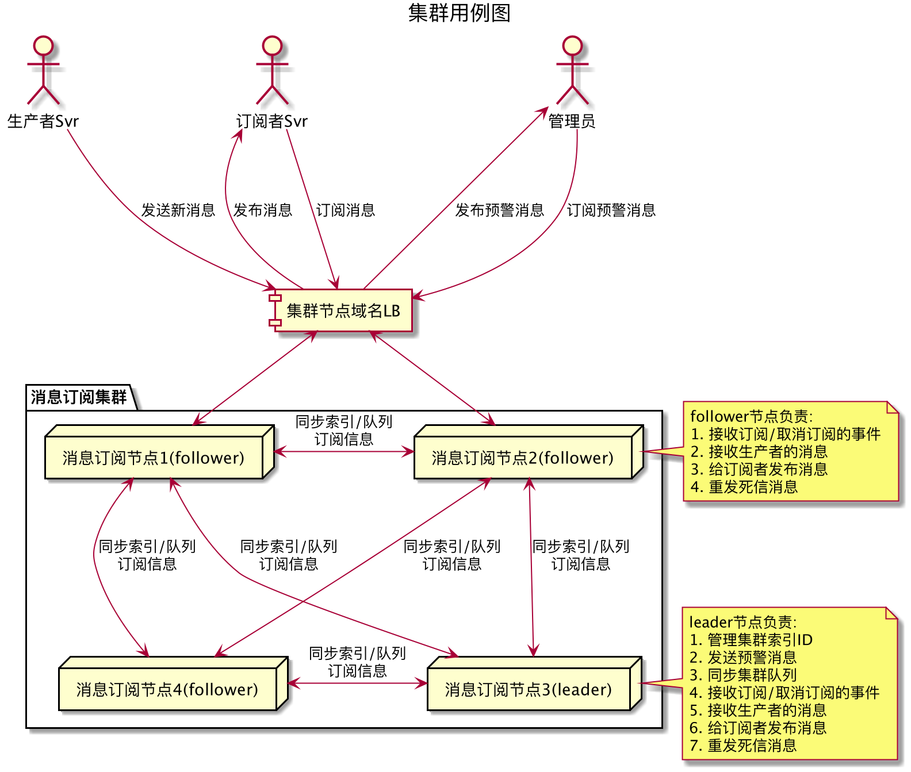
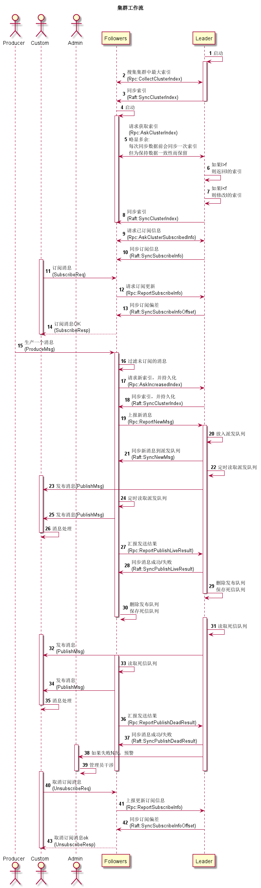

# MsgSubscribeSvr(消息订阅集群服务)

## 用途和特性

1. 拆分服务，可将各个业务微服务最小化处理，有利于项目维护

2. 低耦合，拆分消息生产者和消费者的关系（不关心谁要用，业务服务根据需要上架/下线）

3. 尽量保证消息的前后时序关系（例如必须要登录在前，退出在后）

4. 低延时，正常消息产生和发布在3秒内完成（不含死信消息）

5. 高可靠性，无单点故障

6. 高吞吐率，多节点同时接收和发布

7. 有死信队列，支持消息重发（保证订阅者短暂断开，不丢消息）

8. 每条消息需要有对应的数字cmdid，否则会丢弃消息

9. 自动抛弃未订阅的消息

   

## 订阅者处理

1. 发起tcp，或启动grpc 服务
2. 连上发送订阅事件
3. 接收发布的消息，并处理
4. 断开前，发送取消订阅事件
5. 异常断开时，需要重新连接并订阅

## 发布者处理

1. 发起tcp消息，或发起grpc 方法调用

2. 向连上的集群节点发送消息

   

## 集群

1. 可启动单节点和多节点两种集群模式。多节点模式下不可低于2台，推荐奇数台（低于2台会报警）
2. 每个节点都有选举特权
3. 集群节点之间通过gossip协议维护，派发node join, leave, fail等事件
4. leader根据raft协议选举产生，派发leader, follower等事件
5. 集群之间数据同步通过grpc，同步索引，订阅信息，队列等
6. 支持两种队列模式：内存和磁盘队列。内存运行速度快，磁盘队列不怕集群重启(消息不丢失)
7. 某节点宕机，自动剔除该节点。订阅者自动重连到其他节点上
8. leader宕机，自动产生新leader，继续接受/发布消息
9. 异常预警，人工干预
10. 支持客户端Tcp和grpc stream长链接两种接入，后期考虑介入ws
11. 日志记录，方便回查bug
12. 支持多协议对外入口，tcp/tls, grpc, ws/wss
13. 提供api接口，方便查询集群内存数据（待定）
14. 支持安全链接（待定）
15. 支持订阅者身份认证（待定）
16. 支持consul服务注册和发现（待定）


## 性能测试

1. Cpu 待定
2. Mem 待定
3. Tps 待定


## 缺陷

1. 客户端断开需要取消订阅 ok
2. 同一消息多方订阅 ok
3. 只有follower节点对外 ok
4. 单元测试 ok
5. 订阅信息同步给新节点 ok
6. 用raft来同步数据，而不是用grpc ok

## 参考资料
```http request
http://thesecretlivesofdata.com/raft/
https://raft.github.io/
https://www.infoq.cn/article/coreos-analyse-etcd/
```

## 用例


## 时序
